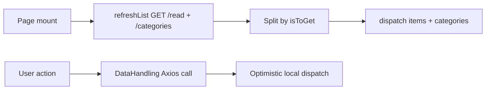

# Shopping List — Project Context (Living Document)

> **For AI agents:** Read this file at the start of any session on this project. When you learn durable facts (architecture, APIs, conventions, deploy setup, bugs, roadmap changes), update the relevant section below and add a dated entry to [Living updates](#living-updates). Do not duplicate this content in the workspace-level `shopping-list/Cursor.md` — keep that file as a short pointer only.

---

## 1. Project snapshot

**Purpose:** A personal/household shopping list web app with two synchronized views — items to buy and items already on hand. Users can add, edit, delete, search, and move items between lists.

**Live services:**
- **Frontend:** Deployed on Netlify (built from `shopping-list/` subdirectory)
- **Backend API:** `https://svac-shopping-list.herokuapp.com`
- **Database:** MongoDB Atlas (accessed via Mongoose in `server/`)

**Monorepo layout:**

```
shopping-list/                    # Git monorepo root (this file lives here)
├── Cursor.md                     # ← Canonical project context (this file)
├── netlify.toml                  # Netlify build config for frontend
├── feature-plans/
│   └── category-labeling-feature.md
├── server/                       # Express + MongoDB backend (gitignored here; has own .git)
│   ├── index.js
│   ├── Procfile                  # Heroku: web: node index.js
│   ├── package.json
│   └── models/
│       ├── Shopping.js
│       └── Category.js
└── shopping-list/                # CRA React frontend (often the Cursor workspace root)
    ├── Cursor.md                 # Short pointer → this file
    ├── package.json
    ├── public/
    └── src/
```

**Repo quirk:** `server/` is listed in the monorepo `.gitignore` but maintains its own `.git` repository. Backend changes may need to be committed separately from frontend/monorepo changes.

---

## 2. Tech stack

### Frontend (`shopping-list/`)

| Technology | Version / notes |
|------------|-----------------|
| React | 18 |
| Create React App | 5 (`react-scripts`) |
| Axios | HTTP client for API |
| CSS | Plain co-located `style.css` per component |
| Font Awesome | 4.7 via CDN in `public/index.html` |

**Not used:** TypeScript, React Router, Redux/Zustand/Context, CSS Modules, Tailwind, Sass, styled-components.

### Backend (`server/`)

| Technology | Purpose |
|------------|---------|
| Express | REST API |
| Mongoose | MongoDB ODM |
| cors | Cross-origin requests |
| dotenv | Environment variables (loaded but Mongo URI is hardcoded) |
| nodemailer | Unrelated `/send-contact-email` endpoint (legacy from another project) |

---

## 3. Data model

### Persisted: `ShoppingItem` (Mongoose)

**File:** `server/models/Shopping.js`

```javascript
{
  itemName: String,    // required
  quantity: Number,    // optional
  units: String,       // optional
  isToGet: Boolean,    // required — true = Shopping List, false = In Stock
  categoryId: ObjectId // optional/nullable — ref Category; null = uncategorized
  _id: ObjectId        // auto-generated
}
```

MongoDB collection name: `shoppingitems` (Mongoose model name `ShoppingItem`).

### Persisted: `Category` (Mongoose)

**File:** `server/models/Category.js`

```javascript
{
  name: String,     // required, unique, trimmed
  order: Number,    // display order (lower first); default 0
  createdAt: Date,  // timestamps
  updatedAt: Date,
  _id: ObjectId
}
```

Categories are shared across Shopping List and In Stock. Deleting a category sets matching items' `categoryId` to `null`.

### Client-side reducer state (`App.js`)

```javascript
{
  toGetItems: [],           // items where isToGet === true
  inStockItems: [],         // items where isToGet === false
  categories: [],           // Category docs sorted by order
  listViewed: "Shopping List" | "In Stock",
  filterSearchTerm: ''      // search/filter string
}
```

### Modal-only state (not persisted)

**Editing popup:** `{ isEditing, editAction, itemType, itemName, itemQuantity, itemUnits, itemID, categoryId, indicatingUnits, indicatingQuantity }`

**Delete popup:** `{ isDeleting, deleteItemName, deleteItemId, deleteItemIsToGet }`

**Categorize popup:** walkthrough queue of uncategorized items (snapshotted when opened)
---

## 4. API contract

**Base URL:** `https://svac-shopping-list.herokuapp.com` (hardcoded in `shopping-list/src/DataHandling.js` and `shopping-list/src/App.js`)

| Method | Path | Body / params | Purpose |
|--------|------|---------------|---------|
| GET | `/read` | — | Fetch all items |
| POST | `/insert` | `{ itemName, quantity?, units?, isToGet, categoryId }` | Create item (`categoryId` required + must exist) |
| PUT | `/update` | `{ id, ...fields }` | Partial update (`$set` on matched `_id`) |
| DELETE | `/delete/:id` | URL param `id` | Delete item |
| GET | `/categories` | — | All categories sorted by `order`, then `name` |
| POST | `/categories` | `{ name }` | Create category (`order` = max+1) |
| PUT | `/categories` | `{ id, ...fields }` | Update category (e.g. rename) |
| PUT | `/categories/reorder` | `{ categoryIds: [...] }` | Set `order` = array index |
| POST | `/categories/merge` | `{ sourceId, targetId }` | Move items from source → target, delete source |
| DELETE | `/categories/:id` | URL param `id` | Null out items' `categoryId`, then delete category |
| POST | `/send-contact-email` | contact form fields | Unrelated legacy endpoint |

**Frontend API helpers** (`shopping-list/src/DataHandling.js`):

| Export | Endpoint used |
|--------|---------------|
| `addToList(item)` | POST `/insert` |
| `updateItem(updatedItem)` | PUT `/update` — sends `{ id: updatedItem._id, ...updatedItem }` |
| `adjustItemQuantity(id, newQuantity)` | PUT `/update` |
| `adjustItemIsToGet(id, newIsToGet)` | PUT `/update` |
| `deleteItem(id)` | DELETE `/delete/:id` |
| `fetchCategories()` | GET `/categories` |
| `createCategory(name)` | POST `/categories` |
| `updateCategory(id, fields)` | PUT `/categories` |
| `reorderCategories(categoryIds)` | PUT `/categories/reorder` |
| `deleteCategory(id)` | DELETE `/categories/:id` |
| `mergeCategories(sourceId, targetId)` | POST `/categories/merge` |

**Known inconsistency:** `App.saveItem()` calls `updateItem({ id: editing.itemID, ... })` (uses `id`, not `_id`). `DataHandling.updateItem` sets `id: updatedItem._id` first, then spreads `updatedItem`, so the spread's `id` field wins. Works today but the shape is confusing — cleanup candidate.

**No authentication.** API is open with CORS enabled.

---

## 5. Frontend architecture

### Boot sequence

```
public/index.html
  └── src/index.js          # React 18 createRoot, StrictMode
        └── src/App.js      # Root state + orchestration
```

### Component tree

```
App.js
├── ShoppingListPage        # src/Pages/ShoppingList/index.js
│   ├── categorize banner   # when uncategorizedCount > 0
│   └── CategoryGroup (×N)  # src/Components/CategoryGroup/
│       └── Item (×N)       # src/Components/Item/index.js
├── NavBar                  # src/Components/NavBar/index.js — bottom tab bar
├── EditPopup (conditional) # src/Components/EditPopup/ — includes CategorySelect
├── DeletePopup (conditional) # src/Components/DeletePopup/index.js
├── CategorizePopup (conditional) # src/Components/CategorizePopup/ — backfill walkthrough
└── ManageCategories (conditional) # src/Components/ManageCategories/ — rename/delete/merge/reorder
```

### Data flow



1. **Load:** `ShoppingListPage` mounts → `refreshList()` → GET `/read` + GET `/categories` → split items by `isToGet` → dispatch lists and categories
2. **Mutate:** Component action → `DataHandling.js` API call → on success, update local lists via dispatch (no full re-fetch)
3. **View switch:** `NavBar` calls `changeListSelection` → dispatch `updateListViewed` (no URL routing)
4. **Display:** Client groups filtered items by `categoryId` in category `order`; uncategorized section last
5. **Category reorder:** ↑/↓ on section headers → optimistic reorder → PUT `/categories/reorder`

### Reducer actions

| Action | Effect |
|--------|--------|
| `updateToGetItems` | Replace shopping list array |
| `updateInStockItems` | Replace in-stock array |
| `addToGetItem` | Append to shopping list |
| `addinStockItem` | Append to in-stock list (note lowercase "in") |
| `updateListViewed` | Switch active tab |
| `setFilterSearchTerm` | Update search string |
| `updateCategories` | Replace categories array |
| `addCategory` | Append category and sort by order/name |
| `updateItemInLists` | Patch one item in both lists by `_id` |

### Key file responsibilities

| File | Role |
|------|------|
| `src/App.js` | Global state, reducer, modal orchestration, `refreshList`, `saveItem`, `removeItem`, category reorder / categorize |
| `src/DataHandling.js` | Thin Axios API client (items + categories) |
| `src/Pages/ShoppingList/index.js` | Title, categorize banner, search/add, grouped list |
| `src/Components/CategoryGroup/` | Category section header with ↑/↓ + Item children |
| `src/Components/CategorySelect/` | Searchable select-or-create category control |
| `src/Components/CategorizePopup/` | One-at-a-time uncategorized walkthrough |
| `src/Components/Item/index.js` | Row UI: quantity +/-, Edit, Delete, Purchased/Ran Out |
| `src/Components/EditPopup/index.js` | Add/edit modal with category, optional quantity & units |
| `src/Components/DeletePopup/index.js` | Delete confirmation |
| `src/Components/NavBar/index.js` | Fixed bottom nav: Shopping List ↔ In Stock |

---

## 6. User-facing features

- **Two lists:** Shopping List (to buy) and In Stock (on hand), toggled via bottom nav
- **Categories:** User-defined grocery sections shared across both lists; items keep `categoryId` when moved Purchased / Ran Out
- **Manage categories:** Header button opens modal to add, rename, delete, reorder (↑/↓), and consolidate (merge one category into another)
- **Grouped display:** Items grouped under category headers in saved `order`; empty categories hidden; **Uncategorized** section last
- **Category reorder:** ↑/↓ on category headers (swaps adjacent visible categories)
- **Category required on add/edit:** Searchable CategorySelect with create-new inline
- **Categorize banner:** When any item lacks `categoryId`, banner opens a skippable one-at-a-time CategorizePopup
- **Search/filter:** Case-insensitive filter by item name as you type; round in-field X clears the search text
- **Sort within category:** Alphabetical by `itemName`
- **Add item:** Type name in search input → "+ Add item" → modal with category + optional quantity/units
- **Edit item:** Edit button → modal pre-filled with current values including category
- **Quantity:** Inline +/- on list rows (won't decrement below 1); optional in add/edit modal
- **Units:** Optional label shown next to quantity
- **Move between lists:** "Purchased" (shopping → in stock) or "Ran Out" (in stock → shopping)
- **Delete:** Trash icon → confirmation modal → DELETE API call

---

## 7. Styling conventions

- **Pattern:** One `style.css` imported per component; shared globals in `src/App.css`
- **Mobile-first:** Fixed bottom nav (~12% viewport height), `maximum-scale=1` in viewport meta
- **Palette:** Cream background `#FFFADD`, item cards blue `#22668D` with gold accent `#FFCC70`
- **Icons:** Font Awesome 4.7 (trash icon on delete button)
- **Class naming:** Semantic strings like `add-item-btn`, `viewedList`, `item-action-buttons`

---

## 8. Dev & deploy

### Frontend (`shopping-list/`)

```bash
npm install
npm start          # CRA dev server, port 3000
npm run dev        # nodemon watches src/, restarts dev server
npm run build      # outputs to build/
npm test           # Jest + Testing Library (watch mode)
```

### Backend (`server/`)

```bash
npm install
node index.js      # listens on process.env.PORT || 3001
```

Heroku: `Procfile` → `web: node index.js`  
Stack: **heroku-24** (upgraded from heroku-22 on 2026-07-22). Deploy via Heroku Git from `server/` (`git push origin master`).

### Netlify (`netlify.toml` at monorepo root)

```toml
[build]
  base = "shopping-list"
  command = "npm install && npm run build"
  publish = "build"
```

### Environment

- Frontend has no `.env` — API URL is hardcoded
- Backend loads `dotenv` but MongoDB connection string is hardcoded in `server/index.js` (should be moved to env vars)

---

## 9. Known issues & tech debt

| Issue | Details |
|-------|---------|
| **Hardcoded secrets** | MongoDB URI and email credentials in `server/index.js` — move to environment variables. Never copy secrets into this doc. |
| **Stale tests** | `src/App.test.js` expects CRA boilerplate "learn react" text — does not match the real app |
| **No feature tests** | No tests for Item, EditPopup, DeletePopup, ShoppingListPage, or DataHandling |
| **Unused asset** | `src/delete.png` — delete button uses Font Awesome instead |
| **Code TODOs** | Unify `addShoppingItem` / `addInStockItem` handlers in App (still passed as two props) |
| **`updateItem` shape** | Inconsistent `id` vs `_id` between `App.saveItem` and `DataHandling.updateItem` |
| **`category` field** | ~~Prop passed in UI, not in schema or API~~ **Resolved 2026-07-22** — `categoryId` on items + Category model/API/UI |
| **Split git repos** | `server/` gitignored in monorepo but has its own `.git` |
| **Legacy endpoint** | `/send-contact-email` in backend is unrelated to shopping list |
| **No error UX** | API failures logged to console only; no user-facing error states |

---

## 10. Roadmap / feature plans

### Category labeling — implemented (2026-07-22)

Lean implementation (not the original mega-spec). See `feature-plans/category-labeling-feature.md` for a short pointer.

**Shipped:**
- `Category` model (`name`, `order`) + nullable `categoryId` on items
- Category CRUD + reorder API routes
- Client-side grouping by category with ↑/↓ reorder
- CategorySelect (search + create) in EditPopup
- Uncategorized banner + CategorizePopup walkthrough

**Possible follow-ups:**
- Drag-and-drop reorder
- Per-list category order
- Auth / per-user categories

---

## Living updates

Changelog maintained by AI agents when new durable context is learned.

| Date | Update |
|------|--------|
| 2026-07-22 | Added Manage Categories UI (rename/delete/reorder/create) and POST `/categories/merge` to consolidate categories. |
| 2026-07-22 | Upgraded Heroku app `svac-shopping-list` from heroku-22 → heroku-24 and deployed category API (Released v9). |
| 2026-07-22 | Implemented item categories: Category model, categoryId on items, category API routes, grouped list UI with ↑/↓ order, CategorySelect in EditPopup, uncategorized banner + CategorizePopup. |
| 2026-07-22 | Search/add input on ShoppingListPage is controlled by `filterSearchTerm` and shows an in-field round clear (X) button that resets the filter and input text. |
| 2026-06-30 | Initial Cursor.md created from full codebase scan. Documented architecture, API, components, deploy, tech debt, and category labeling roadmap. |
